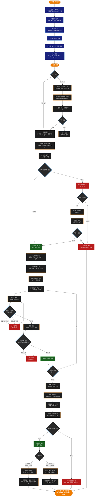

```mermaid
%%{init: {'flowchart': {'curve': 'linear'}}}%%
flowchart TD
    %% ─── 스타일 정의 ───────────────────────────────────────
    classDef startEnd  fill:#F07D00,stroke:#D06E00,color:#fff,font-weight:bold
    classDef process   fill:#1E1E1E,stroke:#F07D00,color:#E8E8E8
    classDef decision  fill:#2A2A2A,stroke:#42A5F5,color:#E8E8E8
    classDef passNode  fill:#1B5E20,stroke:#4CAF50,color:#fff
    classDef failNode  fill:#B71C1C,stroke:#EF5350,color:#fff
    classDef adminNode fill:#1A237E,stroke:#42A5F5,color:#fff

    %% ════════════════════════════════════════════════════════
    %% 0. 관리자 초기 설정 (시스템 사용 전 선행 필수)
    %% ════════════════════════════════════════════════════════
    START([🚀 시스템 초기 설정]):::startEnd

    START --> ADM1[분말 규격 등록\n검사항목별 Min/Max 기준값]:::adminNode
    ADM1 --> ADM2[배합분말 등록\n제품 코드 · 분말 카테고리]:::adminNode
    ADM2 --> ADM3[레시피 등록\n제품별 배합비율 · 허용오차]:::adminNode
    ADM3 --> ADM4[검사자 · 작업자 등록]:::adminNode
    ADM4 --> ADM5[사용자 계정 · 메뉴 권한 설정]:::adminNode
    ADM5 --> ADM6[Bot 설정\nGoogle Sheets ID · Drive API Key]:::adminNode

    ADM6 --> OP([⚙️ 운영 시작]):::startEnd

    %% ════════════════════════════════════════════════════════
    %% 1. 수입검사
    %% ════════════════════════════════════════════════════════
    OP --> B{입고 방식}:::decision

    B -->|수동 입력| C[수입검사 등록\n분말명 · LOT번호 · 검사자 입력]:::process
    B -->|Bot 자동| D[Gmail Bot 자동 수신\nWhitelist 발신자 메일 감지]:::process

    D --> D1[Google Drive에 PDF 저장\nMailLog Sheets에 기록]:::process
    D1 --> D2[시스템에서 Bot 목록 불러오기]:::process
    D2 --> D3{처리 방법}:::decision
    D3 -->|등록| C
    D3 -->|무시| D4[무시 처리\n목록에서 제외]:::process

    C --> E[항목별 측정값 입력\n유동도·밀도·탄소·수분 등 11종]:::process
    E --> F[입도분석 입력\nMesh별 잔류율]:::process
    F --> G{규격 대비 자동 판정}:::decision

    G -->|PASS| H[수입검사 합격\n배합 투입 가능]:::passNode
    G -->|FAIL| I[수입검사 불합격\nNG 확정]:::failNode

    I --> I1{재검사 요청?}:::decision
    I1 -->|예| I2[재검사 요청 등록\n사유 입력]:::process
    I2 --> I3[재검사 수행\n2차 측정값 입력]:::process
    I3 --> I4{재검사 판정}:::decision
    I4 -->|PASS| H
    I4 -->|FAIL| I5[최종 NG 확정\n대시보드 NG현황 반영]:::failNode
    I1 -->|아니오| I5

    %% ════════════════════════════════════════════════════════
    %% 2. 배합작업
    %% ════════════════════════════════════════════════════════
    H --> J[작업지시 등록\n제품명 · 목표중량 · 작업지시번호]:::process
    J --> K[배합작업 시작\n제품 선택 → 레시피 자동 로드]:::process
    K --> L[배합 LOT 자동 생성\n날짜 + 일련번호]:::process
    L --> M[원재료 순차 투입 시작\n1종씩 순서대로 표시]:::process

    M --> N[바코드 스캔\n원재료 LOT 입력]:::process
    N --> O{수입검사 합격\nLOT 검증}:::decision
    O -->|불합격 or 미검사| P[⚠️ 투입 차단\n경고 알림]:::failNode
    O -->|이종분말 감지| P
    P --> N

    O -->|합격| Q[중량 계량\n저울 연동 or 수동 입력]:::process
    Q --> R{허용오차 판정\n목표중량 ± 허용범위}:::decision
    R -->|범위 초과| S[⚠️ 불합격\n재계량 필요]:::failNode
    S --> Q
    R -->|범위 내| T[해당 분말 투입 완료]:::passNode

    T --> U{다음 원재료\n있음?}:::decision
    U -->|예| M
    U -->|아니오| V[전체 투입 완료\n배합작업 완료 처리]:::process
    V --> W[배합 라벨 출력\nQR코드 포함 150×100mm]:::process

    %% ════════════════════════════════════════════════════════
    %% 3. 배합분말 검사
    %% ════════════════════════════════════════════════════════
    W --> X[배합분말 검사 시작\n배합 LOT 선택]:::process
    X --> Y[항목별 측정값 입력\n수입검사와 동일 11종]:::process
    Y --> Z{규격 대비 자동 판정}:::decision

    Z -->|PASS| AA[배합분말 합격\n출하 가능]:::passNode
    Z -->|FAIL| AB[배합분말 불합격\nNG 확정 · 재검사 요청 가능]:::failNode

    %% ════════════════════════════════════════════════════════
    %% 4. 추적성 조회
    %% ════════════════════════════════════════════════════════
    AA --> AC{추적성 조회}:::decision
    AC -->|역방향\n배합LOT 입력| AD[배합에 사용된\n원재료 LOT 목록 표시]:::process
    AD --> AE[원재료별 수입검사 결과\n측정값 · 규격 · 재검사이력 표시]:::process

    AC -->|순방향\n원재료LOT 입력| AF[해당 LOT가 투입된\n배합 작업 목록 표시]:::process
    AF --> AG[배합별 투입중량 · 편차\n검사결과 표시]:::process

    %% ════════════════════════════════════════════════════════
    %% 5. 대시보드
    %% ════════════════════════════════════════════════════════
    AE --> AH([📊 대시보드 모니터링\nKPI · NG현황 · 일별트렌드 · 합격률]):::startEnd
    AG --> AH
    AB --> AH
    I5 --> AH
```
