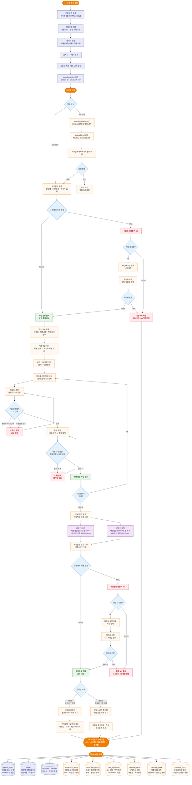

```mermaid
%%{init: {'flowchart': {'curve': 'linear'}}}%%
flowchart TD
    %% ─── 스타일 정의 ───────────────────────────────────────
    classDef startEnd  fill:#F07D00,stroke:#D06E00,color:#fff,font-weight:bold
    classDef process   fill:#FFF8F0,stroke:#F07D00,color:#222
    classDef decision  fill:#E3F2FD,stroke:#1565C0,color:#222
    classDef passNode  fill:#E8F5E9,stroke:#2E7D32,color:#1B5E20,font-weight:bold
    classDef failNode  fill:#FFEBEE,stroke:#C62828,color:#B71C1C,font-weight:bold
    classDef adminNode fill:#E8EAF6,stroke:#283593,color:#1A237E
    classDef labelNode fill:#F3E5F5,stroke:#6A1B9A,color:#4A148C

    %% ════════════════════════════════════════════════════════
    %% 0. 관리자 초기 설정 (시스템 사용 전 선행 필수)
    %% ════════════════════════════════════════════════════════
    START([🚀 시스템 초기 설정]):::startEnd

    START --> ADM1[분말 규격 등록\n검사항목별 Min/Max 기준값]:::adminNode
    ADM1 --> ADM2[배합분말 등록\n제품 코드 · 분말 카테고리]:::adminNode
    ADM2 --> ADM3[레시피 등록\n제품별 배합비율 · 허용오차]:::adminNode
    ADM3 --> ADM4[검사자 · 작업자 등록]:::adminNode
    ADM4 --> ADM5[사용자 계정 · 메뉴 권한 설정]:::adminNode
    ADM5 --> ADM6[Auto Email Bot 설정\nSheets ID · Drive API Key]:::adminNode

    ADM6 --> OP([⚙️ 운영 시작]):::startEnd

    %% ════════════════════════════════════════════════════════
    %% 1. 수입검사
    %% ════════════════════════════════════════════════════════
    OP --> B{입고 방식}:::decision

    B -->|수동 입력| C[수입검사 등록\n분말명 · LOT번호 · 검사자 입력]:::process
    B -->|Bot 자동| D[Auto Email Bot 수신\nWhitelist 발신자 메일 감지]:::process

    D --> D1[Drive에 PDF 저장\nMailLog Sheets에 기록]:::process
    D1 --> D2[시스템에서 Bot 목록 불러오기]:::process
    D2 --> D3{처리 방법}:::decision
    D3 -->|등록| C
    D3 -->|무시| D4[무시 처리\n목록에서 제외]:::process

    C --> G{규격 대비 자동 판정}:::decision

    G -->|PASS| H[수입검사 합격\n배합 투입 가능]:::passNode
    G -->|FAIL| I[수입검사 불합격 NG]:::failNode

    I --> I1{재검사 요청?}:::decision
    I1 -->|예| I2[재검사 요청 등록\n사유 입력]:::process
    I2 --> I3[재검사 수행\n2차 측정값 입력]:::process
    I3 --> I4{재검사 판정}:::decision
    I4 -->|PASS| H
    I4 -->|FAIL| I5[최종 NG 확정\n대시보드 NG현황 반영]:::failNode
    I1 -->|아니오| I5

    %% ════════════════════════════════════════════════════════
    %% 2. 배합작업
    %% ════════════════════════════════════════════════════════
    H --> J[작업지시 등록\n제품명 · 목표중량 · 작업지시번호]:::process
    J --> K[배합작업 시작\n제품 선택 → 레시피 자동 로드]:::process
    K --> L[배합 LOT 자동 생성\n날짜 + 일련번호]:::process
    L --> M[원재료 순차 투입 시작\n1종씩 순서대로 표시]:::process

    M --> N[바코드 스캔\n원재료 LOT 입력]:::process
    N --> O{수입검사 합격\nLOT 검증}:::decision
    O -->|불합격 or 미검사| P[⚠️ 투입 차단\n경고 알림]:::failNode
    O -->|이종분말 감지| P
    P --> N

    O -->|합격| Q[중량 계량\n저울 연동 or 수동 입력]:::process
    Q --> R{허용오차 판정\n목표중량 ± 허용범위}:::decision
    R -->|범위 초과| S[⚠️ 불합격\n재계량 필요]:::failNode
    S --> Q
    R -->|범위 내| T[해당 분말 투입 완료]:::passNode

    T --> U{다음 원재료\n있음?}:::decision
    U -->|예| M
    U -->|아니오| V[전체 투입 완료\n배합작업 완료 처리]:::process

    V --> W1[라벨 ① 출력\n배합분말 원재료 용기 부착\nQR코드 포함 150×100mm]:::labelNode
    V --> W2[라벨 ② 출력\n배합분말 Sampling 통 부착\nQR코드 포함 40×30mm]:::labelNode

    %% ════════════════════════════════════════════════════════
    %% 3. 배합분말 검사
    %% ════════════════════════════════════════════════════════
    W1 --> X[배합분말 검사 시작\n배합 LOT 선택]:::process
    W2 --> X
    X --> Z{규격 대비 자동 판정}:::decision

    Z -->|PASS| AA[배합분말 합격\n출하 가능]:::passNode
    Z -->|FAIL| AB[배합분말 불합격 NG]:::failNode

    AB --> AB1{재검사 요청?}:::decision
    AB1 -->|예| AB2[재검사 요청 등록\n사유 입력]:::process
    AB2 --> AB3[재검사 수행\n2차 측정값 입력]:::process
    AB3 --> AB4{재검사 판정}:::decision
    AB4 -->|PASS| AA
    AB4 -->|FAIL| AB5[최종 NG 확정\n대시보드 NG현황 반영]:::failNode
    AB1 -->|아니오| AB5

    %% ════════════════════════════════════════════════════════
    %% 4. 추적성 조회
    %% ════════════════════════════════════════════════════════
    AA --> AC{추적성 조회}:::decision
    AC -->|역방향\n배합LOT 입력| AD[배합에 사용된\n원재료 LOT 목록 표시]:::process
    AD --> AE[원재료별 수입검사 결과\n측정값 · 규격 · 재검사이력 표시]:::process

    AC -->|순방향\n원재료LOT 입력| AF[해당 LOT가 투입된\n배합 작업 목록 표시]:::process
    AF --> AG[배합별 투입중량 · 편차\n검사결과 표시]:::process

    %% ════════════════════════════════════════════════════════
    %% 5. 대시보드
    %% ════════════════════════════════════════════════════════
    AE --> AH([📊 대시보드 모니터링\nKPI · NG현황 · 일별트렌드 · 합격률]):::startEnd
    AG --> AH
    AB5 --> AH
    I5 --> AH

    %% ════════════════════════════════════════════════════════
    %% 6. DB 저장 목록
    %% ════════════════════════════════════════════════════════
    AH --> DB([🗄️ DB 저장 목록]):::startEnd

    DB --> DB1[(powder_spec\n분말별 검사 규격\nMin/Max 기준값)]:::adminNode
    DB --> DB2[(recipe\n제품별 배합 레시피\n배합비율 · 허용오차)]:::adminNode
    DB --> DB3[(inspector / operator\n검사자 · 작업자 목록)]:::adminNode
    DB --> DB4[(inspection_result\n수입검사 완료 기록\nLOT · 측정값 · 판정)]:::process
    DB --> DB5[(inspection_history\n재검사 회차별 이력\n사유 · 불합격 항목)]:::process
    DB --> DB7[(bot_registered\nBot 등록 · 무시 이력\nDriveFileId 기준)]:::process
    DB --> DB8[(blending_order\n작업지시 목록\n제품명 · 목표중량)]:::process
    DB --> DB9[(blending_work\n배합작업 실적\n배합LOT · 실투입 총량)]:::process
    DB --> DB10[(material_input\n원재료 투입 실적\nLOT별 투입중량 · 편차)]:::process
```
